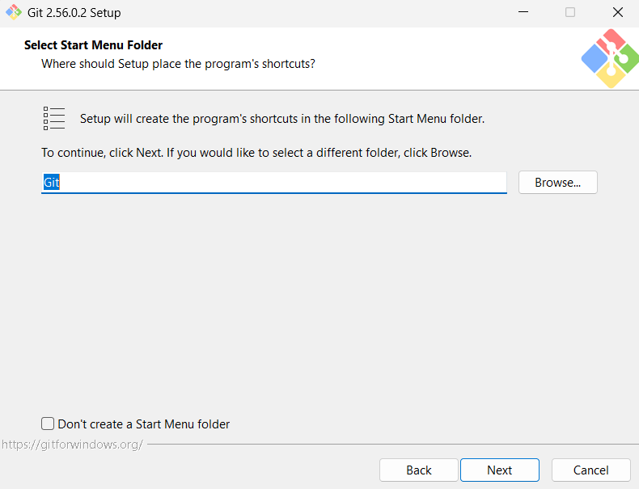
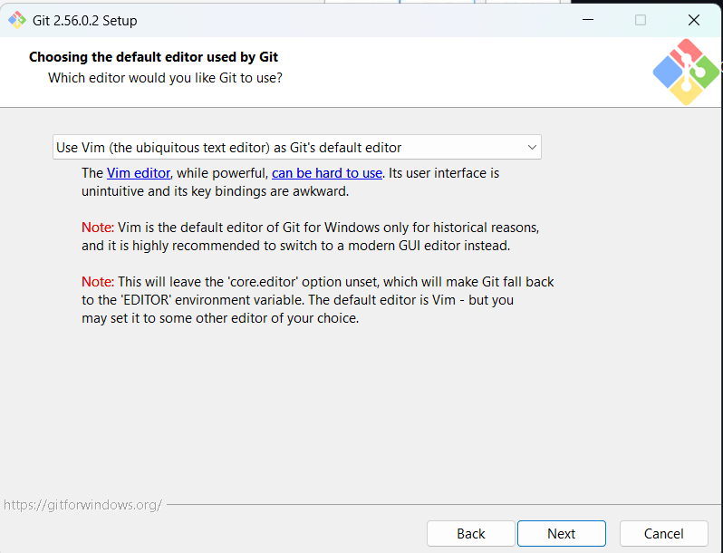

# Praktikum Pertemuan 01

## Nama : NEISA PUTRI SYIFAUL QOLBY

## Nim : 255410020

## Kelas : Informatika-1

---

# A. TUJUAN

Praktikum ini bertujuan untuk:
1. Menguasai konsep dasar sistem kontrol versi menggunakan Git dan platform GitHub.
2. Mempraktikkan proses instalasi Git pada perangkat komputer.
3. Mengonfigurasi identitas awal pengguna (username dan email) di Git.
4. Membuat dan mengelola repositori proyek pada GitHub.
5. Menghubungkan repositori lokal di komputer dengan repositori remote di GitHub.
6. Menerapkan perintah-perintah dasar Git seperti `clone`, `add`, `commit`, `push`, dan `pull`.
7. Memanfaatkan fitur *branch* untuk melakukan pengembangan kode secara terisolasi dan aman.

---

# B. DASAR TEORI

## 1. Pengertian Git

Git adalah sebuah Version Control System (VCS) terdistribusi yang dirancang untuk memantau serta mencatat setiap riwayat perubahan berkas dalam suatu proyek. Perangkat lunak open-source ini memungkinkan pengembang mengelola repositori berkas—baik berupa kode program maupun dokumen digital—secara lokal di komputer masing-masing. Seluruh rekam jejak perubahan disimpan dalam bentuk commit, sehingga pengguna dapat melihat riwayat modifikasi, membandingkan antar-versi, atau mengembalikan berkas ke versi sebelumnya dengan mudah.

## 2 Fitur dan Cara Kerja Git

Git bekerja dengan merekam kondisi riwayat proyek (snapshot) setiap kali commit dilakukan. Struktur kerja Git terbagi menjadi tiga area utama:

Working Directory: Area tempat pengguna membuat, mengubah, atau menghapus berkas proyek.

Staging Area (Index): Area penampung sementara untuk memilih perubahan berkas mana saja yang siap disimpan.

Repository (.git): Tempat penyimpanan permanen tempat Git mencatat seluruh commit, branch, dan rekam jejak sejarah proyek.

## 3. Pengertian GitHub

GitHub merupakan layanan berbasis cloud yang berfungsi sebagai wadah untuk menyimpan dan mengelola repositori Git secara daring. Selain menyediakan ruang penyimpanan remote, GitHub dilengkapi berbagai fitur kolaborasi seperti pembuatan branch, pengajuan Pull Request, pengelolaan issue, serta pembagian hak akses kolaborator. Repositori di GitHub dapat diatur dengan opsi visibilitas public (dapat diakses siapa saja) maupun private (hanya dapat diakses oleh akun yang diberi izin).

## 4. Alur Kerja Kolaborasi (Workflow)
Dalam penggunaan Git dan GitHub, pengembang umumnya mengikuti alur kerja standar:

Branching: Membuat cabang baru agar pengembangan fitur atau perbaikan bug tidak mengganggu kode utama pada branch main.

Push & Pull: Mengunggah perubahan lokal ke repositori remote (push) serta mengambil pembaruan terbaru dari remote ke lokal (pull).

Pull Request (PR) & Merge: Mengajukan peninjauan kode (code review) sebelum hasil kerja pada branch fitur digabungkan kembali ke branch utama.

---

# C. PEMBAHASAN

## INSTALASI GIT

Materi praktikum menyediakan beberapa pilihan instalasi Git. Untuk sistem operasi Windows, instalasi dilakukan menggunakan **Git for Windows**.

Setelah proses instalasi selesai, keberhasilan instalasi dapat diperiksa menggunakan perintah:

```bash
git --version
```

Perintah tersebut akan menampilkan versi Git yang terpasang pada komputer.

---

### 1. Unduh Installer Git
Unduh berkas instalasi dari situs resmi Git (git-scm.com). Setelah selesai diunduh, klik dua kali pada file installer untuk memulai.


**Penjelasan:**
Proses ini dilakukan untuk mendapatkan file instalasi resmi Git agar bisa dipasang di sistem Windows.

---

### 2. Jalankan Installer
Klik **Next** pada jendela awal. Gunakan direktori dan pilihan komponen standar yang disarankan oleh sistem.


**Penjelasan:**
Komponen bawaan (*default*) sudah mencakup semua kebutuhan dasar untuk menjalankan Git.

---

### 3. Pemilihan Text Editor
Tentukan penyunting teks utama untuk Git. Pada praktikum ini digunakan Visual Studio Code.


**Penjelasan:**
Untuk mahasiswa Informatika, Visual Studio Code dapat dipilih karena lebih mudah digunakan untuk mengedit source code maupun file dokumentasi.

---

### 4. Pemilihan Folder Start Menu
Pada tahap ini, tentukan folder Start Menu untuk menyimpan pintasan (*shortcut*) aplikasi Git.



**Penjelasan:**
Folder ini berfungsi membuat pintasan Git di Start Menu agar aplikasi mudah diakses saat dibutuhkan.

---

### 5. Pemilihan Text Editor Defult
Pilih penyunting teks bawaan yang akan digunakan oleh Git ketika membutuhkan masukan teks dari pengguna.




**Penjelasan:**
Pengaturan editor default memastikan Git terhubung dengan editor yang sesuai saat menulis pesan commit maupun mengubah konfigurasi.

---

### 6. Adjusting Initial Branch
Tentukan nama branch awal saat membuat repositori baru. Pilih opsi penamaan branch secara spesifik seperti `main`.


**Penjelasan:**
Penetapan nama `main` dilakukan untuk menyesuaikan dengan standar branch utama di platform GitHub.

---

### 7. Environment PATH
Atur jalur executable Git pada environment variables sistem Windows.


**Penjelasan:**
Pengaturan PATH memungkinkan perintah Git dipanggil langsung melalui Command Prompt, PowerShell, maupun Git Bash.

---

### 8. Pemilihan HTTPS Transport Backend
Pilih pustaka (*library*) backend SSL/TLS yang digunakan Git untuk mengamankan koneksi HTTPS.


**Penjelasan:**
Opsi *native Windows Secure Channel library* dipilih agar validasi sertifikat server memanfaatkan *Windows Certificate Stores* bawaan sistem operasi.
---

### 9. Konfigurasi Line Ending Conversions
Tentukan bagaimana Git menangani karakter akhir baris (*line ending*) pada berkas teks.


**Penjelasan:**
Opsi *Checkout Windows-style, commit Unix-style line endings* dipilih agar Git secara otomatis mengubah format LF menjadi CRLF saat berkas dibuka di Windows, dan mengubahnya kembali menjadi LF saat di-commit.

---

### 10. Konfigurasi Terminal Emulator
Pilih terminal emulator yang akan digunakan saat menjalankan aplikasi Git Bash.


**Penjelasan:**
Penggunaan MinTTY dipilih sebagai terminal bawaan karena mendukung pengaturan ukuran jendela yang fleksibel serta font Unicode.

---

### 11. Pengaturan Perilaku Git Pull
Tentukan tindakan standar saat menjalankan perintah `git pull` untuk mengambil pembaruan dari repositori remote.


**Penjelasan:**
Opsi *Fast-forward only* dipilih agar proses penarikan data berjalan secara langsung jika tidak ada konflik, dan membatalkan proses dengan aman apabila kondisi fast-forward tidak memungkinkan.
---

### 12. Pemilihan Credential Helper
Pilih fitur pengelola kredensial untuk menangani informasi akun pengguna.


**Penjelasan:**
Pilih fitur pengelola kredensial untuk menangani informasi akun pengguna.
---

### 13. Opsi Konfigurasi Tambahan
Tentukan fitur tambahan yang ingin diaktifkan pada sistem.


**Penjelasan:**
Opsi *Enable file system caching* dipilih agar data sistem berkas disimpan sementara di memori untuk meningkatkan performa Git saat pemrosesan.
---

### 14. Proses Ekstraksi dan Instalasi
Proses pemasangan sedang berjalan, sistem mengekstrak dan menyalin seluruh berkas komponen Git ke dalam direktori komputer.


**Penjelasan:**
Tunggu hingga proses ekstraksi dan penyalinan berkas selesai dikerjakan secara otomatis oleh sistem installer.

---

### 15. Finish
Seluruh proses setup instalasi Git telah berhasil disel
esaikan


**Penjelasan:**
Klik tombol **Finish** untuk mengakhiri wizard instalasi[cite: 13]. Git kini sudah terpasang dan siap digunakan.

---

## KONFIGURASI GIT

### 1. Memeriksa Pemasangan Git
Buka terminal (Command Prompt, PowerShell, atau Git Bash) lalu ketik perintah `git` untuk memastikan sistem operasi sudah dapat mengenali dan menjalankan perintah Git.


**Penjelasan:**
Menjalankan perintah `git` tanpa argumen akan menampilkan daftar opsi dan perintah dasar yang tersedia. Hal ini menandakan bahwa Git telah berhasil terpasang dan siap digunakan pada terminal sistem.

---

### 2. Memeriksa Versi Git
Jalankan perintah berikut pada terminal untuk memastikan versi Git yang terpasang di komputer:

```bash
git --version
```


**Penjelasan:**
Perintah ini digunakan untuk menampilkan rincian versi Git yang aktif di sistem. Keluaran versi menandakan bahwa instalasi telah berhasil secara penuh.

---

## 3. Konfigurasi Username & Email
Atur identitas pengguna berupa nama dan email secara global pada Git menggunakan perintah berikut:

```bash
git config --global user.name "NeisaPutri"
git config --global user.email "neisaneisa425@gmail.com"
```


**Penjelasan:**
Pengaturan nama dan email secara global ini bertujuan agar setiap riwayat commit yang dilakukan pada komputer teridentifikasi atas nama pengguna dan email yang terdaftar.

---

## 4. Memeriksa Konfigurasi Git
Tampilkan seluruh daftar konfigurasi Git yang aktif di sistem dengan mengeksekusi perintah berikut:

```bash
git config --list
```


**Penjelasan:**
Perintah ini digunakan untuk memastikan seluruh parameter konfigurasi yang telah diatur—seperti nama pengguna, alamat email, serta pengaturan default lainnya—sudah tersimpan dengan benar di sistem.

---

## MEMBUAT REPOSITORY

## 1. Login Akun Github
Buka situs GitHub di peramban web dan lakukan proses login untuk masuk ke profil akun pengguna.


**Penjelasan:**
Langkah ini dilakukan untuk mengakses dashboard akun GitHub sebelum membuat atau mengelola repositori proyek.

---

## 2. Membuka Menu Pembuatan Repository
Klik ikon tambah (`+`) pada bagian navigasi atas GitHub, lalu pilih opsi **New repository**.


**Penjelasan:**
Menu ini digunakan untuk mengarahkan pengguna ke halaman formulir pembuatan repositori baru di GitHub. 


---

## 3. Menyalin URL Repositori
Setelah repositori berhasil dibuat, klik tombol **<> Code** lalu salin URL HTTPS repositori tersebut.


**Penjelasan:**
URL HTTPS repositori ini digunakan sebagai alamat tujuan saat melakukan proses mengkloning (*clone*) repositori remote ke dalam komputer lokal.

---


## CLONE REPOSITORY

## 1. Mengkloning Repositori dari GitHub
Jalankan perintah `git clone` diikuti URL repositori untuk mengunduh proyek ke komputer lokal:

```bash
git clone [https://github.com/NeisaPutri/prak-dis-dec.git](https://github.com/NeisaPutri/prak-dis-dec.git)
```


**Penjelasan:**
Perintah ini mengunduh seluruh berkas dan riwayat commit dari repositori remote GitHub ke dalam direktori lokal komputer.

---

## 2. Memeriksa Struktur Direktori .git
Jalankan perintah berikut untuk melihat struktur direktori internal Git pada folder proyek:

```bash
tree .git/
```


**Penjelasan:**
Perintah ini digunakan untuk menampilkan struktur pohon folder .git/ yang berisi konfigurasi, riwayat commit, direktori objects, serta referensi branch repositori lokal.

---

## MEMBUAT DAN MENGOLAH FILE BARU

## 1. Membuat Pull Request
Buka halaman repositori di GitHub, pilih branch yang berisi perubahan (misalnya `edit-readme-1`), lalu klik tombol **Open a pull request**. Isi judul dan deskripsi perubahan yang dilakukan.


**Penjelasan:**
*Pull Request* (PR) digunakan untuk mengajukan gabungan perubahan dari sebuah *branch* kerja ke *branch* utama (`main`) agar dapat ditinjau sebelum digabungkan.

---

## 2. Memeriksa Status dan Melakukan Commit
Jalankan perintah `git status` untuk mengecek kondisi direktori kerja, tambahkan seluruh perubahan menggunakan `git add -A`, lalu simpan perubahan dengan `git commit`:

```bash
git status
git add -A
git commit -m "Add: isi README.md"
```


**Penjelasan:**
Perintah git add -A menandai seluruh perubahan berkas untuk dimasukkan ke staging area, sedangkan git commit mencatat perubahan tersebut secara permanen ke dalam riwayat branch kerja.

---

# D. KESIMPULAN

## Berdasarkan praktikum yang telah dilakukan, dapat disimpulkan bahwa:
1. **Pemahaman Sistem VCS**: Penggunaan Git sebagai *Version Control System* (VCS) mempermudah pelacakan dan pengelolaan riwayat perubahan berkas secara terstruktur dan efisien di tingkat lokal.
2. **Pengintegrasian Remote Repository**: Hubungan antara repositori lokal dan remote di GitHub memungkinkan penyimpanan berbasis cloud yang aman serta memfasilitasi alur kerja kolaboratif.
3. **Penerapan Alur Kerja Dasar**: Eksekusi perintah-perintah dasar Git seperti `clone`, `status`, `add`, `commit`, hingga `push` berhasil mengelola siklus hidup perubahan berkas dari *working directory* hingga ke *staging area* dan repositori utama.
4. **Isolasi Fitur melalui Branching**: Penggunaan *branch* dan *Pull Request* terbukti efektif untuk melakukan pengembangan fitur atau perubahan kode secara aman tanpa mengganggu kestabilan *branch* utama (`main`).


<p align="center">

**Praktikum Pert 1 — Git dan GitHub**

*Sistem Terdistribusi dan Terdesentralisasi*

</p>