# Praktikum Pertemuan 01

## Nama : NEISA PUTRI SYIFAUL QOLBY

## Nim : 255410020

## Kelas : Informatika-1

---

# A. TUJUAN

Praktikum minggu pertama bertujuan untuk:

1. Memahami pengertian dasar Git dan GitHub.
2. Melakukan instalasi Git pada komputer.
3. Melakukan konfigurasi identitas pengguna pada Git.
4. Membuat repository pada GitHub.
5. Menghubungkan repository GitHub dengan repository lokal.
6. Memahami proses `clone`, `add`, `commit`, `push`, dan `pull`.
7. Memahami penggunaan branch untuk mengembangkan suatu perubahan secara lebih aman.

---

# B. DASAR TEORI

## 1. Pengertian Git

Git merupakan sistem pengendalian versi atau **Version Control System (VCS)** yang digunakan untuk mencatat perubahan pada file dari waktu ke waktu. Git dapat digunakan untuk mengelola source code, dokumentasi, maupun berbagai jenis dokumen digital.

Git bekerja secara terdistribusi sehingga repository dapat disimpan pada komputer lokal dan dapat dihubungkan dengan repository remote seperti GitHub. Dengan sistem tersebut, perubahan yang dilakukan oleh pengguna dapat dicatat dalam bentuk **commit** sehingga riwayat perubahan dapat diketahui.

Git merupakan perangkat lunak **open source** dan dapat digunakan melalui command line maupun berbagai aplikasi dengan antarmuka grafis.

## 2. Pengertian GitHub

GitHub merupakan platform berbasis web yang digunakan untuk menyimpan repository Git secara online. GitHub tidak hanya digunakan sebagai tempat menyimpan source code, tetapi juga menyediakan fasilitas untuk bekerja sama seperti branch, issue, Pull Request, review, dan pengelolaan collaborator.

Repository GitHub dapat dibuat dengan status **public** maupun **private**. Repository public dapat dilihat oleh pengguna lain, sedangkan repository private hanya dapat diakses oleh pengguna yang memiliki izin.

---

# C. PEMBAHASAN

## INSTALASI GIT

Materi praktikum menyediakan beberapa pilihan instalasi Git. Untuk sistem operasi Windows, instalasi dilakukan menggunakan **Git for Windows**.

Setelah proses instalasi selesai, keberhasilan instalasi dapat diperiksa menggunakan perintah:

```bash
git --version
```

Perintah tersebut akan menampilkan versi Git yang terpasang pada komputer.

---

### 1. Download Git
Git dapat diunduh melalui website resmi Git.

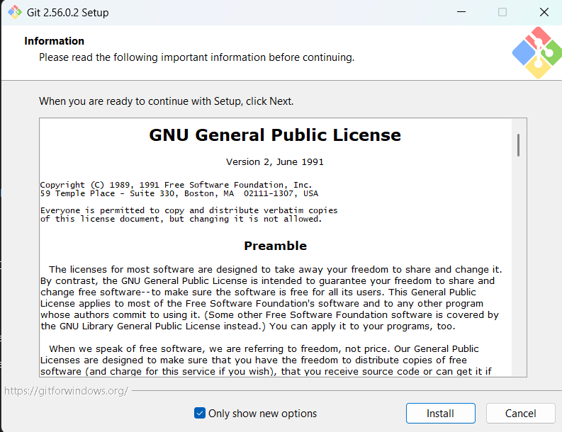

Setelah installer berhasil diunduh, jalankan file installer tersebut dengan melakukan **double click**.

---

### 2. Proses Instalasi
Pada halaman awal installer, klik:
**Next**
Kemudian tentukan lokasi instalasi Git. Jika tidak ada kebutuhan khusus, lokasi default dapat digunakan.
Selanjutnya akan muncul pilihan komponen. Pada tahap ini dapat menggunakan pilihan default.

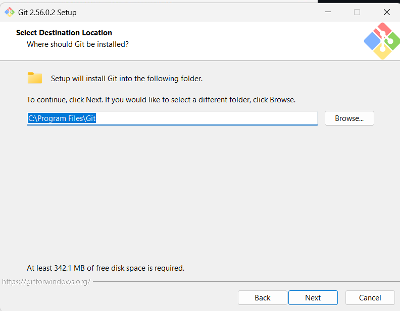

**Penjelasan:**
Pada bagian ini pengguna dapat menentukan komponen tambahan yang akan dipasang bersama Git. Untuk kebutuhan praktikum, pengaturan bawaan installer dapat digunakan.

---

### 3. Memilih Text Editor
Git membutuhkan text editor yang dapat digunakan ketika Git memerlukan editor untuk membuat pesan commit atau melakukan konfigurasi tertentu.
Beberapa editor yang dapat digunakan antara lain:
* Visual Studio Code
* Notepad++
* Vim
* Editor lainnya

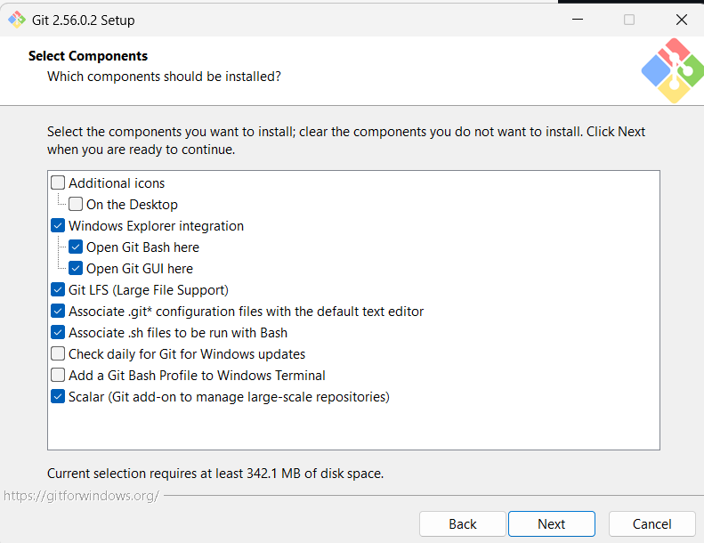
**Penjelasan:**
Untuk mahasiswa Informatika, Visual Studio Code dapat dipilih karena lebih mudah digunakan untuk mengedit source code maupun file dokumentasi.

---

### 4. Pemilihan editor default untuk Git.

Pada proses instalasi Git terdapat pilihan nama branch awal.
Branch utama dapat menggunakan:
```text
main
```


**Penjelasan:**
Branch merupakan jalur pengembangan dalam Git. Penggunaan nama `main` sesuai dengan penggunaan branch utama pada banyak repository GitHub modern dan digunakan dalam praktikum ini.

---

### 5. Pemilihan editor default untuk Git.

Pada pilihan penggunaan Git dari command line, gunakan pilihan yang memungkinkan Git digunakan melalui command prompt maupun Git Bash.


**Penjelasan:**
Dengan pengaturan tersebut, perintah Git dapat dijalankan melalui beberapa terminal pada Windows seperti Command Prompt, PowerShell, maupun Git Bash.


---

### 6. Pemilihan Brach Git
Untuk koneksi repository GitHub, Git dapat menggunakan HTTPS.

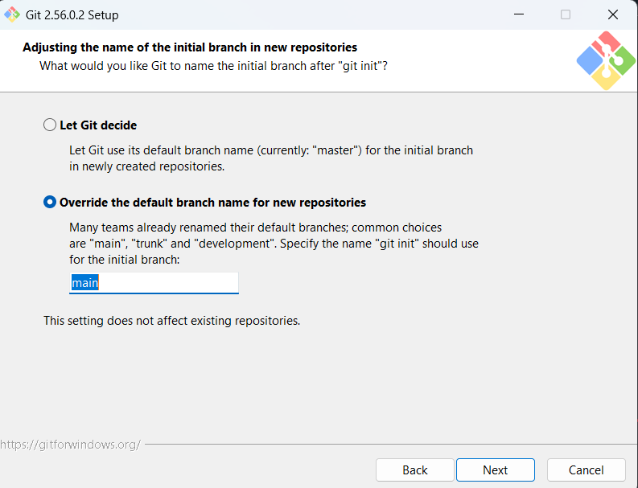

Pada installer Git for Windows, gunakan pilihan library HTTPS yang direkomendasikan oleh installer.

---

### 7. Instalasi Git
Pada tahap berikutnya dilakukan pengaturan konversi akhir baris atau **line ending**.


**Penjelasan:**
Line ending merupakan karakter yang digunakan untuk menandai akhir sebuah baris pada file teks. Pengaturan ini membantu menjaga kompatibilitas file ketika digunakan pada sistem operasi yang berbeda.

---

### 8. HTTPS
Pilih **MinTTY** sebagai terminal yang digunakan untuk mengakses Git Bash.


**Penjelasan:**
Git Bash menyediakan lingkungan terminal yang dapat digunakan untuk menjalankan perintah Git pada Windows.

---

### 9. Conversion
Tetapkan perilaku standar dari `git pull`.
Pada praktikum ini digunakan pilihan default:

**Fast-forward or merge**

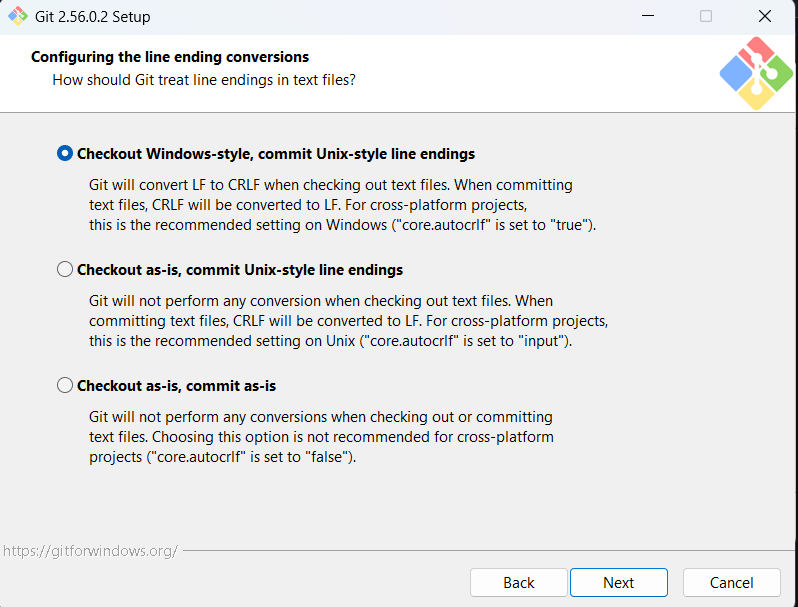

**Penjelasan:**
Pengaturan ini menentukan bagaimana Git menangani perubahan dari repository remote ketika perintah `git pull` dijalankan. Pembahasan lebih lanjut mengenai proses merge akan dipelajari pada materi berikutnya.

---

### 10. Configuring
Pada tahap ini dilakukan pemilihan credential helper.

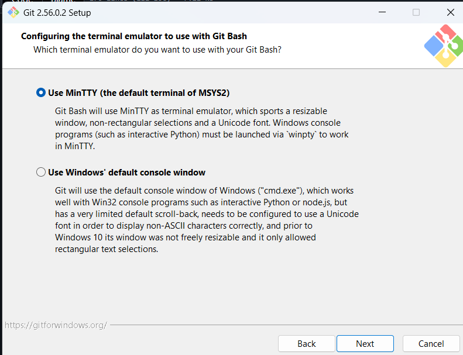

**Penjelasan:**
Credential helper digunakan untuk membantu proses autentikasi ketika Git berkomunikasi dengan repository remote.

---

### 11. Git Pull
Pada opsi tambahan, aktifkan **file system caching**.


**Penjelasan:**
File system caching dapat membantu meningkatkan performa Git ketika mengakses sistem file.

---

### 12.Helper
Setelah seluruh konfigurasi selesai, klik:
**Install**

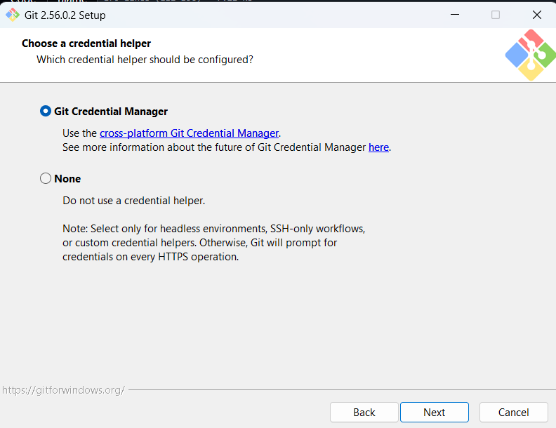
Tunggu hingga proses instalasi selesai.
Setelah proses selesai, klik:

### 13. Enable

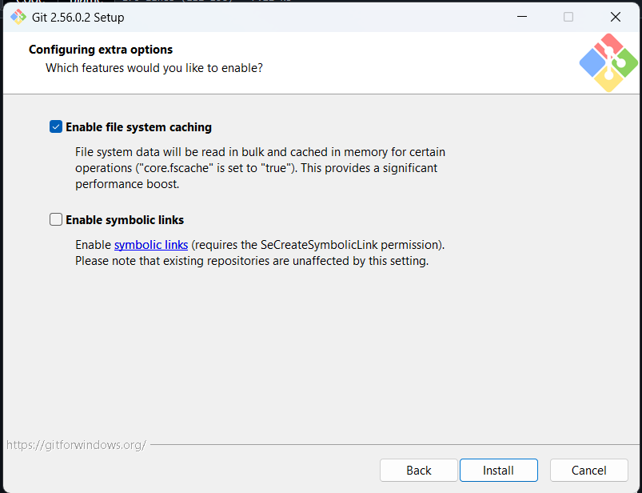
**Finish**

### 14. Installing

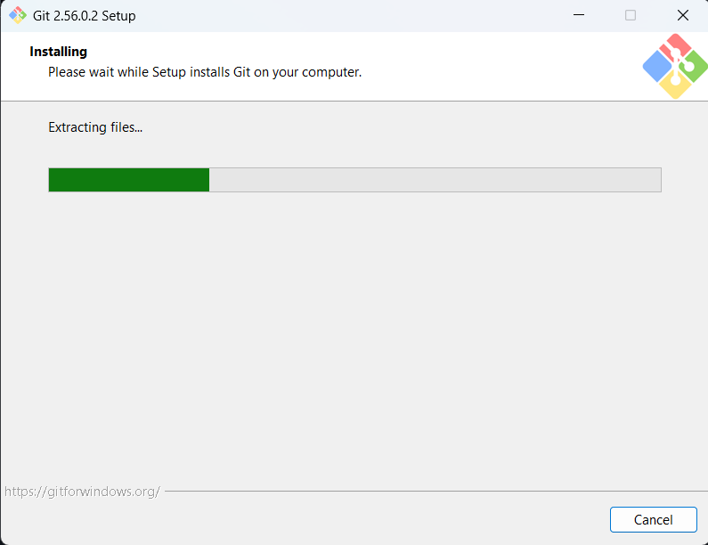

**Penjelasan:**
Tahap ini menandakan bahwa seluruh komponen Git telah selesai dipasang pada komputer.

### 15. Finish


---


### KONFIGURASI GIT

### 1. Verifikasi Git
Setelah instalasi selesai, buka **Command Prompt**, PowerShell, atau Git Bash.
Kemudian lakukan pengecekan instalasi Git.


**Penjelasan:**
Pengecekan dilakukan untuk memastikan bahwa sistem operasi sudah dapat mengenali perintah Git.

---

### 2.pengecekan GIT
Untuk melihat versi Git yang terpasang, jalankan perintah:

```bash
git --version
```


**Penjelasan:**
Perintah `git --version` digunakan untuk mengetahui versi Git yang sedang terpasang.
Jika terminal menampilkan nomor versi Git, berarti Git telah berhasil diinstal dan dapat digunakan.
Versi Git yang muncul dapat berbeda tergantung versi Git yang terpasang pada komputer.

---

## 3. Konfigurasi Username & Email
Konfigurasi username Git dilakukan menggunakan perintah:

```bash
git config --global user.name "Nama Anda"
```


**Penjelasan:**
Perintah `git config` digunakan untuk mengatur konfigurasi Git.
Parameter:

```text
--global
```
---

## 4. cek konfig git 
Konfigurasi email dilakukan menggunakan perintah:

```bash
git config --global user.email "email@example.com"
```


**Penjelasan:**
Email digunakan sebagai salah satu identitas pengguna Git dan akan dicatat pada setiap commit.
Email yang digunakan sebaiknya merupakan email yang terhubung dengan akun GitHub agar identitas commit dapat dikaitkan dengan akun GitHub.

---

### Membuat Repository

## 1. cek konfig git 
Branch default dapat diatur menjadi `main` menggunakan perintah:

```bash
git config --global init.defaultBranch main
```


**Penjelasan:**
Konfigurasi tersebut menentukan bahwa ketika repository baru dibuat menggunakan:

```bash
git init
```
## 2. Membuat Repository baru
branch awal yang digunakan akan memiliki nama:

```text
main
```

Pengaturan ini membuat nama branch utama konsisten dengan repository GitHub yang digunakan dalam praktikum.

---

# contoh nama 


Untuk melihat konfigurasi Git yang telah tersimpan, jalankan:

```bash
git config --list
```
## 3. hasil repository baru


**Penjelasan:**
Perintah `git config --list` digunakan untuk menampilkan konfigurasi Git yang tersimpan pada komputer.
Dari hasil tersebut dapat diperiksa apakah:
* Username sudah benar.
* Email sudah benar.
* Branch default sudah menggunakan `main`.
* Konfigurasi Git lainnya sudah tersimpan.

---

---


## CLONE REPOSITORY

Setelah repository berhasil dibuat pada GitHub, repository tersebut dapat disalin ke komputer lokal menggunakan perintah `git clone`.

## 1. Clone Repository

Gunakan perintah:

```bash
git clone <URL-REPOSITORY>
```

Contoh:
```bash
git clone https://github.com/username/nama-repository.git
```

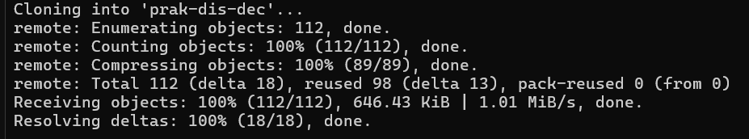

**Penjelasan:**
Perintah `git clone` digunakan untuk membuat salinan repository remote dari GitHub ke komputer lokal.
Dengan melakukan clone, pengguna akan mendapatkan:
* File yang terdapat pada repository.
* Riwayat commit.
* Informasi repository Git.
* Hubungan antara repository lokal dan repository remote.

---

## 2. Struktur

Setelah proses clone selesai, masuk ke folder repository menggunakan perintah:

```bash
cd nama-repository
```

Contoh:

```bash
cd praktikum-sistem-terdistribusi
```

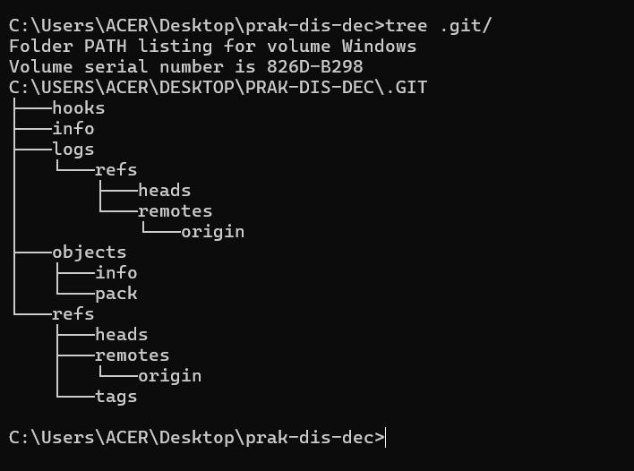

**Penjelasan:**
Perintah `cd` atau **change directory** digunakan untuk berpindah ke folder repository yang telah di-*clone*.
Setelah berada di dalam folder tersebut, perintah Git dapat digunakan untuk mengelola repository lokal.
Struktur repository dapat diperiksa untuk memastikan file dan folder yang diperlukan telah berhasil dibuat.

---

## MEMEBUAT FILE BARU

Setelah repository berhasil di-*clone*, tahap berikutnya adalah membuat atau mengubah file yang berada di dalam folder repository.
## 1. Cek Status
Buat sebuah file baru di dalam folder repository.
Contoh file:

```text
README.md
```

atau file lain sesuai dengan kebutuhan praktikum.

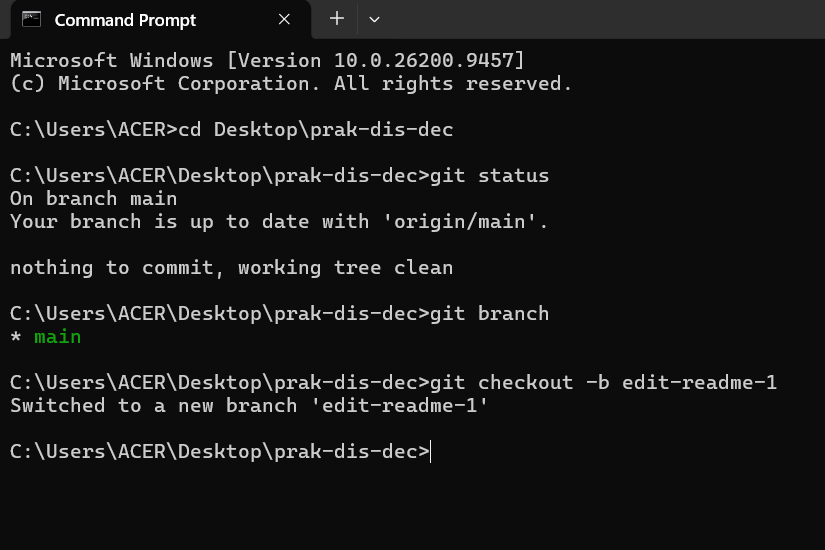

**Penjelasan:**
File yang dibuat atau diubah di dalam repository lokal akan terdeteksi oleh Git sebagai perubahan (*changes*).
Perubahan tersebut belum langsung tersimpan ke dalam riwayat Git. Untuk melihat perubahan yang terdeteksi oleh Git, gunakan perintah `git status`.

---

## 2. Mengecek Status Repository
Gunakan perintah:

```bash
git status
```


**Penjelasan:**
Perintah `git status` digunakan untuk mengetahui kondisi repository saat ini.
Git akan memberikan informasi mengenai file yang:
* Baru dibuat.
* Telah diubah.
* Dihapus.
* Belum dimasukkan ke staging area.
* Sudah berada di staging area.
Contoh alur perubahan file:

```text
File dibuat / diubah
        ↓
   git status
        ↓
   git add
        ↓
   git commit
        ↓
   git push
```

Pada tahap Praktik 5, perubahan masih berada pada repository lokal dan belum dikirim ke repository GitHub. Proses `add`, `commit`, dan `push` akan digunakan pada tahap berikutnya.


<p align="center">

**Praktikum Minggu 01 — Git dan GitHub**

*Sistem Terdistribusi dan Terdesentralisasi*

</p>